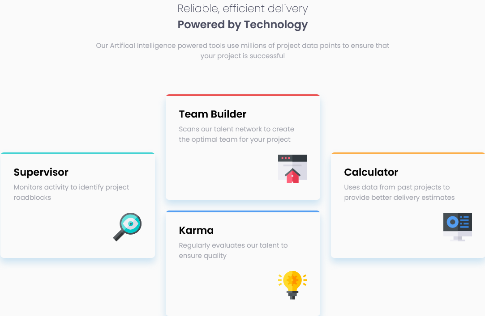

# Frontend Mentor - Four card feature section solution

This is a solution to the [Four card feature section challenge on Frontend Mentor](https://www.frontendmentor.io/challenges/four-card-feature-section-weK1eFYK). Frontend Mentor challenges help you improve your coding skills by building realistic projects. 

## Table of contents

- [Overview](#overview)
  - [The challenge](#the-challenge)
  - [Screenshot](#screenshot)
  - [Links](#links)
- [My process](#my-process)
  - [Built with](#built-with)
  - [Useful resources](#useful-resources)
- [Author](#author)
- [Acknowledgments](#acknowledgments)

## Overview

### The challenge

Users should be able to:

- View the optimal layout for the site depending on their device's screen size

### Screenshot

### Links

- Solution URL: [https://www.frontendmentor.io/solutions/responsive-4-card-feature-section-using-css-grid-SJZo-iDIq](https://www.frontendmentor.io/solutions/responsive-4-card-feature-section-using-css-grid-SJZo-iDIq)
- Live Site URL: [https://rivercodes.github.io/four-card-feature-section/](https://rivercodes.github.io/four-card-feature-section/)

## My process

- I was unsure of whether to use Grid or Flexbox and so I first experimented and made a model of the layout on [CodePen](https://codepen.io/rivercodes/pen/OJQMKyv).
- Once the layout was working on CodePen, I started working on the actual page, starting with the desktop design first. I was using grid, nested flexbox and flexbox properties to move the cards around. I did not really have a good reason for doing what I did, it just seemed right to me. I thought I was taking the right approach using Flexbox as I was more comfortable with it and Flexbox is better for flexible layouts without defined widths and heights right?
- Well, it was not the best aproach as i realized later once I got to working on the mobile design. I forgot to take into account the sizing of all the components and thus everything began resizing in a very ugly way once I started messing around with screen sizes. My design was breaking and not dynamically responsive. My design was kinda working enough that I could've left it there. But I did not want to do that. It was frustrating me why my solution turned out so messy, even after prototyping it on CodePen.
- I then got a timely notification that a user I follow on Frontend Mentor had submitted the same [@ArthurPog](https://www.frontendmentor.io/solutions/a-simple-mobile-first-approach-with-a-css-flex-and-grid-combo-BJsjCjrLc). His solution was so cool, using 3 breakpoints, and his code was very clean and effective. I was surprised at how simply he was able to swap the cards around using Grid. His solution also showed me how to achieve the top-border look that I was struggling with on the design.
- So I then started researching and learning about Grid a little bit more. I spent a couple hours doing this and understanding Arthur's solution better. It was also my first time becoming familiar with nth-child selectors in CSS. Before this I was assigning unnecessary unique classes everywhere.
- After all the preparation, I started anew on 90% of my CSS. I was using Grid mostly and Flexbox for the content inside the cards. Most importantly, I was more aware of where and why I was using Grid/Flexbox compared to last time, where I was applying them without a clear puropose.
- Surprisingly, I was able to remake the complete design in an hour's time. I even managed to make a few modifications and optimizations of my own. I also commented my code properly for the first time. Seeing Arthur's dedication to maintaining his code and repository inspired me.

### Built with

- Semantic HTML5 markup
- CSS custom properties
- Flexbox
- CSS Grid
- Mobile-first workflow

### Useful resources

- [@ArthurPog's solution for this challenge](https://www.frontendmentor.io/solutions/a-simple-mobile-first-approach-with-a-css-flex-and-grid-combo-BJsjCjrLc) - I've already written about how much this solution helped me. This project was frustrating me and seeing this solution inspired and motivated me haha.

## Author

- Frontend Mentor - [@riverCodes](https://www.frontendmentor.io/profile/riverCodes)
- Discord - SharksDontBark#3123

## Acknowledgments

Thanks @ArthurPog! Thanks Frontend Mentor
